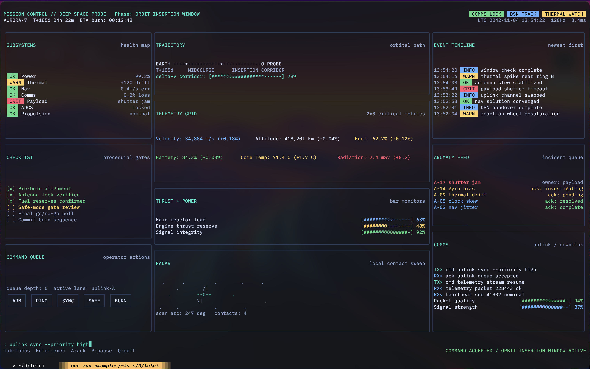
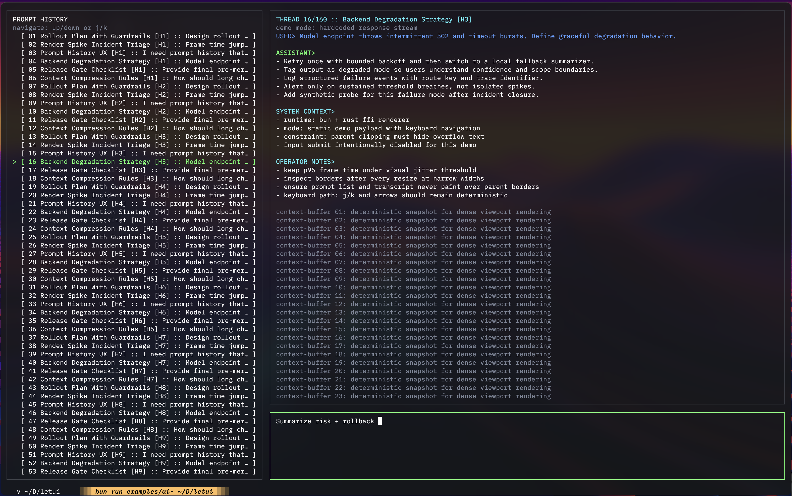

# LeTUI

TUI library with a Rust rendering core, built for interactive full-screen terminal apps. Performance of `ratatui`, ecosystem of TypeScript. No more `Ink`. Written from scratch.




Demo video:

https://github.com/user-attachments/assets/a84f8b6c-86fd-4f42-9ec8-84edd24c7abd

## Prerequisites

- Runtime: [Bun](https://bun.sh/) 1.3+ (Node.js not supported — native bridge uses Bun FFI)
- Prebuilt binaries: `darwin-arm64`, `linux-x64`, `win32-x64`
- Rust toolchain if building locally

## Quick start

```bash
git clone https://github.com/frixaco/letui.git
cd letui
bun install
bun run build-ffi
bun run examples/hello-world.ts
```

More examples:

```bash
bun run dev
bun run examples/mission-control.ts
bun run examples/ai-agent.ts
bun run examples/visualizer.ts
bun run examples/progress-bar.ts
```

(`bun run anitrack` is for personal testing and requires `mpv` player configured with `Anime4K` shaders)

Checks:

```bash
bun run typecheck
bun run smoke
bun run metrics:smoke
```

## Install as a library

```bash
bun add @frixaco/letui typescript
```

On supported targets, install pulls the matching native binary automatically.

Minimal reactive app:

```ts
import { $, COLORS, Column, Text, ff, onKey, run } from "@frixaco/letui";

const count = $(0);
const counterText = Text({
  text: "count: 0",
  foreground: COLORS.default.fg,
});

ff(() => {
  counterText.setText(`count: ${count()}`);
});

const root = Column(
  {
    flexGrow: 1,
    gap: 1,
    padding: "1 1",
    background: COLORS.default.bg,
    border: { color: COLORS.default.bg_highlight, style: "rounded" },
  },
  [
    Text({ text: "hello from letui", foreground: COLORS.default.fg }),
    counterText,
    Text({
      text: "+ / - update, q quit, Ctrl+Q default quit",
      foreground: COLORS.default.grey,
    }),
  ],
);

const app = run(root);

onKey("+", () => count(count() + 1));
onKey("-", () => count(count() - 1));
onKey("q", () => app.quit());
```

```bash
bun run app.ts
```

## How it works

1. Signals-based TypeScript runtime drives updates
2. Each reactive frame snapshots the current node tree into JS-side sent state
3. If node shape stays compatible, JS sends only style deltas plus text ops; if shape changes, Rust tree state is rebuilt once
4. Rust keeps persistent tree state, runs layout + paint, and owns the terminal buffers
5. Frame data is synced back to JS nodes for hit-testing and `frame` / `frameWidth()` / `frameHeight()`
6. Terminal output is cell-based and incremental; flush only writes changed cells

## Architecture

- **TypeScript** — component API, signals, input routing, sent-tree diffing, op encoding
- **Rust** — persistent tree state, style/text op application, layout, paint, incremental flush
- **Bun FFI** — bridge for op buffers, frame buffers, and lifecycle hooks
- Packaged native binaries for `darwin-arm64`, `linux-x64`, `win32-x64`
- Only deps: `crossterm` and `taffy` Rust crates, everything written from scratch.

Debug metrics split the frame into `serialize`, `textSync`, `rust`, `sync`, and `flush`. Enable with `run(root, { debug: true })`; output writes to `dump/metrics.txt`.

## Performance

Frame latency is <1ms for practical workloads.

Benchmark snapshot (`2026-02-20`, `terminal-rerender`, `full` profile, PTY mode):

| Metric       |       letui |       Rezi |               Delta |
| ------------ | ----------: | ---------: | ------------------: |
| Mean latency |       20 µs |     259 µs | letui 12.69× faster |
| p95 latency  |       21 µs |     260 µs |         letui lower |
| Throughput   | 48.6K ops/s | 3.9K ops/s | letui 12.46× higher |
| Peak RSS     |     60.4 MB |   128.2 MB |   letui 2.12× lower |
| PTY bytes    |     43.2 KB |    30.1 KB |  letui 1.43× higher |

## Docs

- [Index](./docs/README.md)
- [Getting started](./docs/getting-started.md)
- [Components & styling](./docs/components-and-styling.md)
- [State, events & lifecycle](./docs/state-events-lifecycle.md)
- [Releasing](./docs/releasing.md)
- [Troubleshooting](./docs/troubleshooting.md)

## Status

Mid-stage, active development. Core reactive runtime, persistent Rust tree state, incremental text sync, terminal diffing, and Bun FFI bridge are working. Public API is intentionally small.

## TODO

- [ ] Globals ops queue (see `./docs/FULL_RUST_AUTHORITY_SPEC.md`)
- [ ] Text styling: markdown and syntax highlighting API
- [ ] Safer quit/cleanup when used as a library
- [ ] Responsive examples for smaller terminal sizes
- [ ] Vertical and horizontal scrolling
- [ ] Multi-line text input and shortcuts
- [ ] Persistent Taffy tree
- [ ] Experiment: Neovim as text input via [Bun PTY](https://bun.com/docs/runtime/child-process#terminal-pty-support)
- [ ] Refactor `flush` with `BatchWriter` pattern
- [ ] Performance stats overlay

## Releasing

See [docs/releasing.md](./docs/releasing.md).
